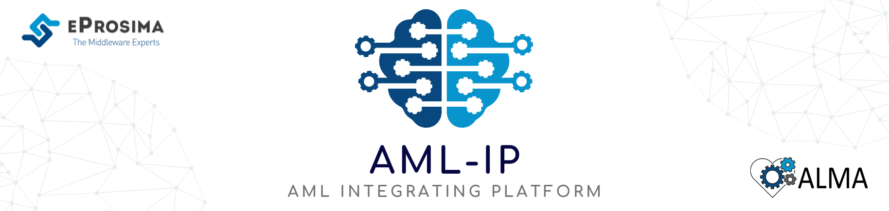

 

    <strong>
        <a href="https://eprosima.com/index.php/downloads-all">Download</a>
        &nbsp;&nbsp;•&nbsp;&nbsp;
        <a href="https://aml-ip.readthedocs.io/en/latest">Docs</a>
        &nbsp;&nbsp;•&nbsp;&nbsp;
        <a href="https://alma-ai.eu/index.php/news">News</a>
        &nbsp;&nbsp;•&nbsp;&nbsp;
        <a href="https://twitter.com/EProsima">Twitter</a>
        &nbsp;&nbsp;•&nbsp;&nbsp;
        <a href="mailto:info@eprosima.com">Contact Us</a>
    </strong>

  

    
    
    
    
    
    
    
    

  

*eProsima AML-IP (Algebraic Machine Learning - Integrating Platform)* is a communications framework in charge of data exchange between Algebraic Machine Learning (AML) nodes through local or remote networks.
It is designed to allow non-experts users to create and manage a cluster of AML nodes to exploit the distributed and concurrent learning capabilities of AML.
Thus, AML-IP is a communication framework that makes the transport protocols abstracted from the user, creating a platform that communicates each node without requiring the user to be concerned about communication issues.

## Documentation

You can access the documentation online, which is hosted on [Read the Docs](https://aml-ip.readthedocs.io).

* [Introduction](https://aml-ip.readthedocs.io/en/latest/rst/formalia/titlepage.html)
* [Getting Started](https://aml-ip.readthedocs.io/en/latest/rst/getting_started/project_overview.html)
* [User Manual](https://aml-ip.readthedocs.io/en/latest/rst/user_manual/scenarios/scenarios.html)
* [Demos](https://aml-ip.readthedocs.io/en/latest/rst/demo/collaborative_learning.html)
* [Developer Manual](https://aml-ip.readthedocs.io/en/latest/rst/developer_manual/installation/sources/linux/linux.html)
* [Release Notes](https://aml-ip.readthedocs.io/en/latest/rst/notes/notes.html)

## Installation Guide

The instructions for installing *AML-IP* application from sources and its required dependencies are provided in the [documentation installation guide](https://aml-ip.readthedocs.io/en/latest/rst/installation/linux.html) for `Linux` or `Windows`.

---

This project (ALMA: Human Centric Algebraic Machine Learning) has received funding from the European Union’s Horizon 2020 research and innovation programme under grant agreement No 952091.
